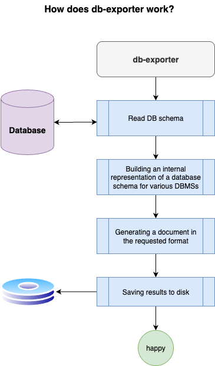
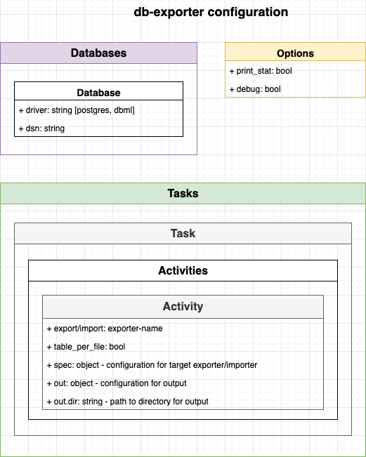

# db-exporter


**db-exporter** - application for export db schema and data to formats

[🚀 Use with GitHub Actions](./docs/usage_examples.md#use-with-github-actions)

[🚀 Use with Gitlab CI](./docs/usage_examples.md#use-with-gitlab-ci)

**Exporters**

| Exporter                 | Description                                                                     | Usage example                                                                                                 |
|--------------------------|---------------------------------------------------------------------------------|---------------------------------------------------------------------------------------------------------------|
| `grpc-crud`              | Exports CRUD in .proto from database schema                                     |                                                                                                               |
| `ddl`                    | Exports DDL from database schema                                                |                                                                                                               |
| `csv`                    | Exports data from tables                                                        |                                                                                                               |
| `md`                     | Exports database schema to Markdown                                             | [Schema ➡️ Markdown](./docs/usage_examples.md#export-schema-from-postgresql-to-markdown)                      |
| `diagram`                | Exports database schema as image of Class Diagram                               |                                                                                                               |
| `go-entities`            | Go structures with db tags                                                      | [Schema ➡️ Go entities, repositories](./docs/usage_examples.md#export-schema-to-go-entities-and-repositories) |
| `go-entity-repository`   | Go structures with db tags and repositories                                     |                                                                                                               |
| `goose`                  | Goose migrations                                                                |                                                                                                               |
| `goose-fixtures`         | Exports data from tables as inserts to Goose migrations                         |                                                                                                               |
| `go-sql-migrate`         | Migrations for [sql-migrate](https://github.com/rubenv/sql-migrate)             |                                                                                                               |
| `laravel-migrations-raw` | Raw SQL Laravel migrations                                                      |                                                                                                               |
| `laravel-models`         | Exports database schema as Laravel models                                       |                                                                                                               |
| `json-schema`            | Exports database schema to [JSON Schema](https://json-schema.org)               |                                                                                                               |
| `graphql`                | Exports database schema to [GraphQL](https://graphql.org/learn/schema) types    |                                                                                                               |
| `dbml`                   | Exports database schema to DBML (table, ref, enum)                              |                                                                                                               |
| `custom`                 | Exports DB schema by your template with [Twig](https://twig.symfony.com) syntax | [Generating .txt files from a template built into the configuration](./docs/usage_custom.md)                  |
| `mermaid`                | Exports DB schema to Mermaid ER Diagram                                         |                                                                                                               |

Supported database schemas:
-  PostgreSQL
-  DBML: only export db schema, without fixtures and import
-  MySQL

usage:
```text
Usage
  db-exporter[--config] [--tasks]

Options
  config                        Path to config file (yaml), default: ./.db-exporter.yaml
  tasks                         task names of config file

Usage examples
  db-exporter --config db.yaml  Run db-exporter with custom config path
```

<center></center>

## Configuration

The exporter operates on tasks that have activities.



For example, to describe the export of a database schema to a GraphQL, the following configuration is required.

```yaml
databases:
  default:
    driver: postgres
    dsn: ${PG_DSN}

tasks:
  gen_graphql:
    activities:
      - format: graphql
        out:
          dir: ./out/graphql
```

Config file declared in [JSON Schema](db-exporter-json-schema.json)

### Environment variables
You can inject environment variables to config:

- **DSN** to database in `databases`:
    ```yaml
    databases:
      default:
        driver: postgres
        dsn: $PG_DSN
    ```
- **Commit Author** in `tasks`:
    ```yaml
  tasks:
    gen_docs:
      commit: 
        author: ${COMMIT_AUTHOR}
      activities:
        ...
    ```
- **Tables List** in `activities`
    ```yaml
  tasks:
    gen_csv:
      activities:
        - format: csv
          tables:
            list: ${MY_TABLES}
    ```
