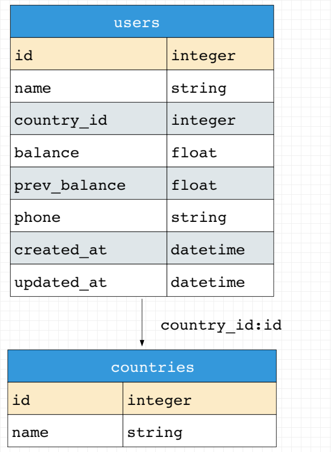

# Usage examples

## 🚀Use with GitHub Actions

You can run `db-exporter` as a GitHub action.

Add config file `.db-exporter.yaml`:
```yaml
databases:
  default:
    driver: postgres
    dsn: ${PG_DSN}

tasks:
  gen_docs:
    commit:
      message: "[auto] add documentation for database schema"
      push: true
    activities:
      - format: md
        spec:
          with_diagram: true
        out:
          dir: ./docs
```

Add GitHub Action as `./.github/workflows/docs.yaml`
```yaml
name: Generate documentation

permissions: write-all

on:
  push:
    branches:
      - master

jobs:
  generate-docs:
    services:
      postgres:
        image: postgres:12
        env:
          POSTGRES_USER: test
          POSTGRES_PASSWORD: test
          POSTGRES_DB: cars
        ports:
          - 5499:5432

    runs-on: ubuntu-latest
    steps:
      - name: Checkout Source
        uses: actions/checkout@v3

      # step for run migration

      - name: Generate markdown docs
        uses: artarts36/db-exporter@master
        env:
          PG_DSN: "host=localhost port=5499 user=test password=test dbname=cars sslmode=disable"
        with:
          tasks: gen_docs
````

## 🚀Use with Gitlab CI

You can run `db-exporter` in Gitlab CI.

Add config file `.db-exporter.yaml`:
```yaml
databases:
  default:
    driver: postgres
    dsn: $GOOSE_DBSTRING

tasks:
  gen_docs:
    commit:
      message: "[auto] add documentation for database schema"
      author: 'username <your@mail.ru>'
      push: true
    activities:
      - format: md
        spec:
          with_diagram: true
        out:
          dir: ./docs
```

Add `.gitlab-ci.yml`
```yaml
variables:
  # Configure postgres service (https://hub.docker.com/_/postgres/)
  POSTGRES_DB: users
  POSTGRES_USER: test
  POSTGRES_PASSWORD: test

.use-postgres: &use-postgres
  services:
    - postgres:17.6-alpine

stages:
  - db_docs

gen-diagram:
  <<: *use-postgres
  stage: db_docs
  variables:
    GOOSE_DRIVER: postgres
    GOOSE_DBSTRING: "host=postgres port=5432 user=test password=test dbname=users sslmode=disable"
    GOOSE_MIGRATION_DIR: './migrations'
  script:
    - echo "download goose"
    - curl https://github.com/pressly/goose/releases/download/v3.26.0/goose_linux_x86_64 -L -o goose && chmod +x goose
    - echo "download db-exporter"
    - curl https://github.com/ArtARTs36/db-exporter/releases/download/v0.5.4/db-exporter-linux-amd64.zip -L -o db-exporter.zip && unzip db-exporter.zip db-exporter && chmod +x db-exporter
    - echo "run migrations"
    - ./goose up
    - echo "run db-exporter"
    - ./db-exporter --tasks=gen_diagram
````

## Export schema from PostgreSQL to Markdown

Our schema for users and countries:
```sql
CREATE TABLE users
(
    id   integer NOT NULL,
    name character varying NOT NULL,
    country_id integer,
    balance real NOT NULL,
    prev_balance real,
    phone character varying,
    created_at timestamp NOT NULL,
    updated_at timestamp,

    CONSTRAINT users_pk PRIMARY KEY (id)
);

CREATE TABLE countries
(
    id integer NOT NULL,
    name character varying NOT NULL,

    CONSTRAINT countries_pk PRIMARY KEY (id)
);

ALTER TABLE users ADD CONSTRAINT user_country_fk FOREIGN KEY (country_id) REFERENCES countries(id);
```

Add config file as `.db-exporter.yaml`

```yaml
databases:
  default:
    driver: postgres
    dsn: ${PG_DSN}

tasks:
  gen_md:
    activities:
      - format: md
        spec:
          style:
            font:
              family: courier

            background:
              grid:
                cell_size: 20
        out:
          dir: ./out
```

Run: `PG_DSN="port=5459 user=db password=db dbname=db sslmode=disable" db-exporter`

**Result**



## Export schema to Go entities and repositories

Add config file as `.db-exporter.yaml`
```yaml
databases:
  default:
    driver: postgres
    dsn: $PG_DSN

tasks:
  export:
    activities:
      - format: go-entity-repository
        skip_exists: true
        spec:
          entities:
            package: internal/domain
          repositories:
            package: internal/infrastructure/repositories
            container:
              struct_name: group
            interfaces:
              place: entity
            with_mocks: true
        out:
          dir: ./ # is root project path
```

Run export: `$PG_DSN="port=5459 user=db password=db dbname=db sslmode=disable" db-exporter --tasks=export`
